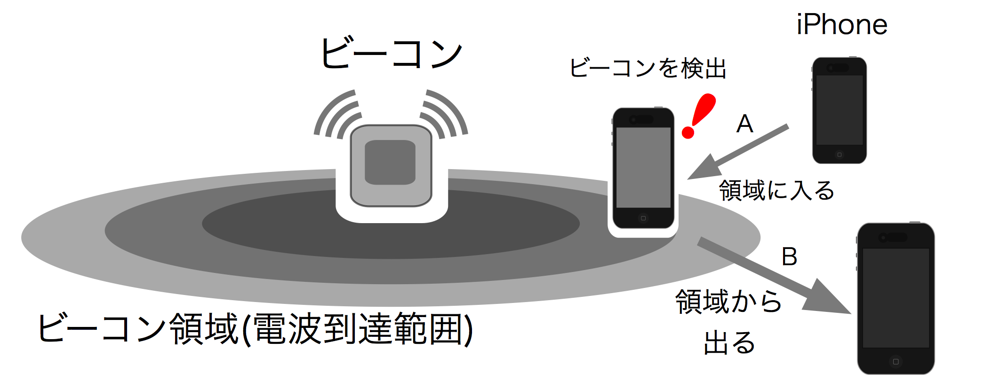

## PandocをつかったKindle出版のサンプル

[Pandoc](http://johnmacfarlane.net/pandoc/README.html) を使いiBeaconハンドブックをMacな環境で書くのに使った、プリプロセッサとビルドスクリプトです。epub形式とPDF形式を1ソースから生成します。

## PDFを生成するためのLaTeX環境構築
Lualatexを使います。 http://oku.edu.mie-u.ac.jp/~okumura/texwiki/?Mac の手順どおりです:

1. パッケージ MacTeX.pkg をインストール。
2. コマンドラインから更新。 $ sudo tlmgr update --self --all

次に、 http://oku.edu.mie-u.ac.jp/~okumura/texwiki/?Mac#i9febc9b の手順でフォント設定をします。Macを利用しているので:

~~~~.csh
$ sudo mkdir -p /usr/local/texlive/texmf-local/fonts/opentype/hiragino/
$ cd /usr/local/texlive/texmf-local/fonts/opentype/hiragino/
$ sudo ln -fs "/Library/Fonts/ヒラギノ明朝 Pro W3.otf" ./HiraMinPro-W3.otf
$ sudo ln -fs "/Library/Fonts/ヒラギノ明朝 Pro W6.otf" ./HiraMinPro-W6.otf
$ sudo ln -fs "/Library/Fonts/ヒラギノ丸ゴ Pro W4.otf" ./HiraMaruPro-W4.otf
$ sudo ln -fs "/Library/Fonts/ヒラギノ角ゴ Pro W3.otf" ./HiraKakuPro-W3.otf
$ sudo ln -fs "/Library/Fonts/ヒラギノ角ゴ Pro W6.otf" ./HiraKakuPro-W6.otf
$ sudo ln -fs "/Library/Fonts/ヒラギノ角ゴ Std W8.otf" ./HiraKakuStd-W8.otf
$ sudo mktexlsr
~~~~

## テキストの作成
まずテキストをMarkdown記法で記述します。ソースは章単位などの適当なかたまりでファイルに分割記述できます。スクリプトが、docs/ フォルダ以下にある拡張子 "md" のファイルを降順ソートして1つのファイルにまとめます。図はpng形式で、fig/ 以下に置きます。

### 図表の参照
Pandocには図表やテーブル番号の参照機能がないため、プリプロセッサで補っています。

図表は、このように#につづけてタグ名を入れておきます。タイトルの前には"図1.1"や"表1.1"のような図表番号が入れられます。
```


Table: #table_ble_spec Bluetooth Low Energyの物理層の特性
```

タグをかっこで囲むことで、、その図表番号を文中で参照できます。"図1.1"や"表1.1"といった図表番号のテキストに置換されます。リンクはしません。

```
[#fig_ibeacon_intro]

[#table_ble_spec]
```


### epub形式のファイルを出力
出力ファイル名は build.sh にベタ書きしています。build.sh 先頭の変数を適当にいじってください。build.sh を実行するとepub形式のファイルが出来上がります。

### PDF形式のファイルを出力
出力ファイル名は build-pdf.sh にベタ書きしています。PDFのタイトルは、latex/header.txt にベタ書きしています。
build.sh 先頭の変数を適当にいじってください。build.sh を実行するとepub形式のファイルが出来上がります。